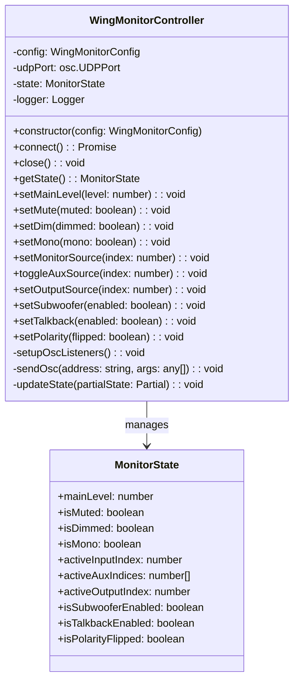
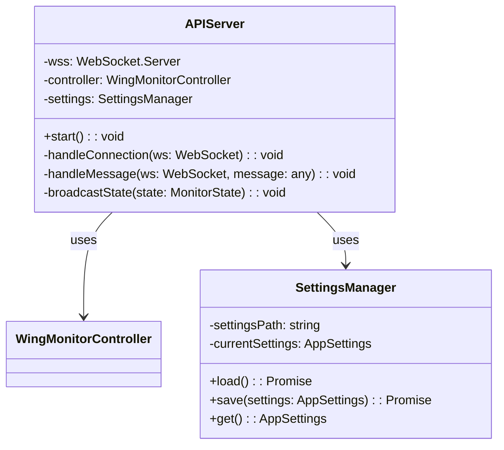
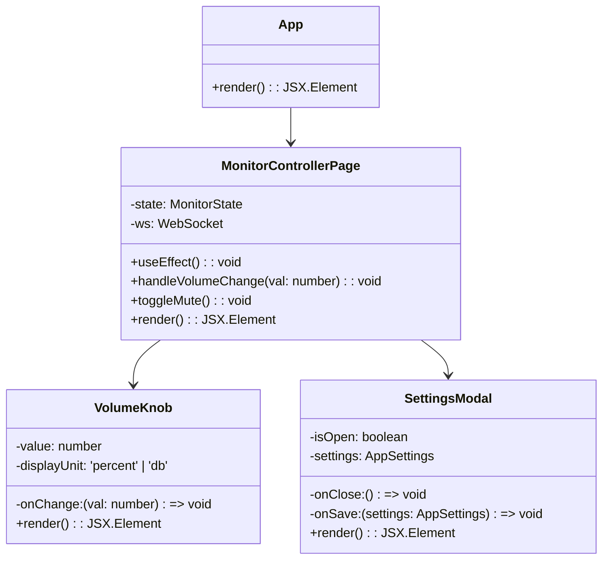

# Class Diagrams

## WingMonitorController (libs/wing-controller)

This class encapsulates the core logic for interacting with the Behringer Wing console.

## API Server (apps/api)

The API server handles WebSocket connections and settings persistence.

## Web Client (apps/web-client)

The React frontend components.

